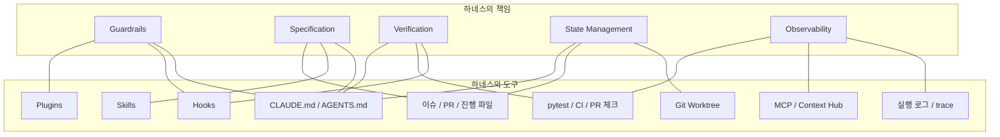

## **Prompt, Context, Harness**

| **층위** | **핵심 질문** | **초점** |
| --- | --- | --- |
| `Prompt` | 무엇을/어떻게 말할 것인가 | 명령의 품질<br>단일 프롬프트<br>정적 |
| `Context` | 무엇을/어떻게 보여줄 것인가 | 정보의 품질<br>입력 파이프라인<br>동적 |
| `Harness` | 무엇을/어떻게 통제할 것인가 | 시스템의 안정성<br>실행 환경 전체<br>시스템 아키텍처 |

[^04-v01]

> **Prompt ⊂ Context ⊂ Harness**
> 

하네스는 프롬프트와 컨텍스트를 없애는 개념이 아닙니다. 둘을 포함하는 구조입니다. 프롬프트는 한 번 말하는 법이고, 컨텍스트는 그 말이 기대는 정보의 묶음이며, 하네스는 둘이 실제로 돌아가는 실행 환경 전체입니다.

좋은 하네스는 여전히 좋은 프롬프트를 필요로 하고, 좋은 컨텍스트를 필요로 합니다. 다만 그것들이 단발성 요령으로 흩어지지 않게 만듭니다. 안쪽이 부실하면 바깥도 같이 무너집니다. 모호한 한 줄 프롬프트는 좋은 컨텍스트로도 다 못 메우고, 허술한 컨텍스트는 좋은 하네스 위에서도 계속 잡음을 만듭니다.

## **하네스의 구성요소**

`Agent = Model + Harness` "모델이 아닌 것은 전부 하네스입니다." - LangChain, Vivek Trivedy  모델이 텍스트를 생성하는 엔진이라면, 하네스는 그 엔진이 어떤 연료를 먹고 어떤 도구를 잡고 어떤 울타리 안에서 움직일지 정하는 운영체제에 가깝습니다. 하네스는 말의 힘을 수레에 연결하는 마구처럼, 강력하지만 예측 불가능한 LLM을 실제 일에 쓸 수 있게 만드는 장치입니다.

하네스를 실행 관점에서 풀면 여섯 가지 구성 요소로 정리할 수 있습니다.[^04-v02]

| **구성 요소** | **무엇을 맡는가** |
| --- | --- |
| `Context Engineering` | 모델이 봐야 할 정보와 버려야 할 정보를 고른다 |
| `Tool Orchestration` | 어떤 도구를 어떤 순서와 권한으로 호출할지 정한다 |
| `State & Memory` | 세션이 길어져도 상태가 증발하지 않게 파일과 기록으로 남긴다 |
| `Verification Loop` | 테스트, 린트, 리뷰 |
| `Error Recovery` | 실패를 감지하고 재시도, 우회, 중단 |
| `Human-in-the-Loop Control` | 사람 승인과 개입 지점을 고정한다 |

하나의 루프를 어디까지 자동화하고 어디서 멈출지 정하는 한 묶음입니다.

## **에이전트 루프: 하네스의 심장**

거의 모든 코딩 에이전트는 `gather context`, `take action`, `verify work`, `repeat` 네 단계를 반복합니다. 하네스 엔지니어링은 결국 이 네 지점을 신뢰성 있게 만드는 일입니다.

- `gather context`: 무엇을 더 보여줄지가 아니라 무엇을 안 보여줄지 설계하는 단계입니다.
- `take action`: 가능한 한 되돌릴 수 있는 액션부터 허용해야 합니다.
- `verify work`: 이 문이 비면 환각과 오해가 다음 루프의 입력으로 굳어집니다.
- `repeat`: 이전 대화 전체를 끌고 가는 대신 현재 결론과 다음 행동만 남길 줄 알아야 합니다.

## **하네스의 책임**

운영 관점에서 보면 하네스의 책임은 다섯 개 기능 블록으로 정리할 수 있습니다.[^04-v08]

| **블록** | **하는 일** | **구현 예시** |
| --- | --- | --- |
| `Guardrails` | 위험한 행동을 막고 권한 경계를 고정한다 | 승인 규칙, 샌드박스, 위험 명령 차단 |
| `Specification` | 작업 범위와 기준선을 흔들리지 않게 고정한다 | 스펙, 계획 문서, 규칙 파일 |
| `Verification` | 결과를 결정론적으로 걸러낸다 | `lint`, `type check`, 테스트, 리뷰 게이트 |
| `State Management` | 세션이 바뀌어도 상태가 증발하지 않게 한다 | 파일, Git 이력, 이슈, 진행 기록 |
| `Observability` | 루프가 어디서 흔들리는지 보이게 한다 | 실행 로그, 행동 trace, checkpoint |

좋은 설계 순서는 다음과 같습니다.

1. 먼저 필요한 기능 블록을 정의한다.
2. 각 기능을 어떤 파일, 도구, 명령어, 게이트에 배치할지 정한다.
3. 항상 읽혀야 할 것과 필요할 때만 로딩할 것을 분리한다.
4. 우회하면 안 되는 것은 훅과 테스트처럼 결정론적 게이트로 만든다.
5. 시간이 지나 불필요해진 규칙은 제거할 수 있게 둔다.

## **하네스의 도구**[^04-v03]

도구 레이어는 그 책임을 실제로 구현하는 수단입니다. `CLAUDE.md`, `AGENTS.md`, `Skills`, `Hooks`, `MCP`, `Plugins`, `Git Worktree` 같은 이름은 기능 블록 자체가 아니라, 기능 블록을 실행 환경 안에 배치하는 방법입니다.

기능 블록과 도구 레이어는 1:1로 대응하지 않습니다. 하나의 도구가 여러 책임을 맡을 수 있고, 하나의 책임도 여러 도구로 구현될 수 있습니다.



예를 들어 `Hooks`는 위험 명령을 막으면 `Guardrails`가 되고, 테스트를 자동 실행하면 `Verification`이 됩니다. `CLAUDE.md`는 명세이면서 컨텍스트 기준선이 될 수 있고, 금지 명령이나 리뷰 기준을 담으면 약한 `Guardrails` 역할도 합니다. `Git Worktree`는 상태 관리와 격리 모두에 기여합니다.

예를 들어 “테스트를 반드시 통과해야 한다”는 요구는 먼저 `Verification`이라는 기능 블록입니다. 그다음 구현 수단을 고릅니다. `pytest`, CI, `PostToolUse` Hook, PR 체크, 리뷰 체크리스트가 모두 도구 레이어가 될 수 있습니다.

중요한 것은 도구 이름이 아니라 그 도구가 어떤 책임을 맡는가입니다.

`CLAUDE.md`나 프롬프트를 쓸 때 가장 흔한 실수는 두 극단입니다. 너무 낮게 쓰면 모든 케이스를 `if/else`처럼 박아 넣느라 brittle해지고, 너무 높게 쓰면 "잘 해줘", "깔끔하게" 같은 문장이 되어 세션마다 결과가 흔들립니다. 실무에서 가장 강한 형식은 대개 `원칙 1줄 + 이유 1줄 + 예시 1~2개`입니다. 이 정도 고도여야 새 상황에도 일반화되면서도 행동이 변하지 않습니다.

| **도구** | **역할** | **강제력** |
| --- | --- | --- |
| `CLAUDE.md` | 프로젝트 기준선과 지속 컨텍스트를 고정한다 | 세션마다 자동 로드되지만 기본적으로는 권고에 가깝다 |
| `Skills` | 필요할 때만 불러오는 재사용 workflow를 담는다 | 호출될 때 강해진다 |
| `Hooks` | 이벤트에 반응해 자동 검증과 차단을 수행한다 | 우회하기 어려운 결정론적 문이 된다 |
| `Plugins` | 개인이 만든 하네스를 팀 단위 자산으로 포장해 배포한다 | 조직 차원의 재사용성을 만든다 |

`CLAUDE.md`나 `AGENTS.md` 같은 규칙 파일은 프로젝트의 기준선을 고정합니다. 이 파일에는 매 세션 반복해서 설명할 필요가 없는 내용이 들어가야 합니다.

- 프로젝트 구조와 주요 디렉터리
- 코딩 스타일과 네이밍 규칙
- 금지 명령과 위험 작업 승인 규칙
- 테스트와 린트 실행 방식
- 문서 작성 어투
- 리뷰 기준
- 자주 발생한 실수와 회피 규칙

다만 모든 것을 이 파일 하나에 밀어 넣으면 안 됩니다. 상시 읽혀야 할 기준과 특정 작업에서만 필요한 절차가 섞이면 규칙 파일은 기준이 아니라 소음이 됩니다. 프로젝트 전체의 기준은 규칙 파일에, 특정 업무 절차는 `Skills`에, 우회 불가능한 검증은 `Hooks`와 테스트에 두는 편이 낫습니다.

`Skills`는 필요할 때 불러오는 작업 지식입니다. 예를 들어 “PR 리뷰 작성”, “릴리즈 노트 작성”, “TDD 루프 수행”, “문서 요약” 같은 절차를 스킬로 만들 수 있습니다. 스킬은 항상 컨텍스트에 올라와 있을 필요가 없습니다. 이름과 설명만 보이다가 필요할 때 상세 내용이 로딩되는 편이 좋습니다.

`Hooks`는 이벤트 기반 자동화입니다. 특정 도구 호출 전후에 실행되어 위험 명령을 차단하거나, 포맷을 확인하거나, 테스트를 강제할 수 있습니다. 훅은 “에이전트가 마음이 내키면 하는 일”이 아니라 우회하기 어려운 문이어야 합니다.

`MCP`와 `Plugins`는 외부 도구와 데이터를 연결하는 층입니다. 사내 시스템, GitHub, Notion, Slack, DB 같은 리소스를 연결할 수 있습니다. 다만 연결이 많다고 좋은 하네스는 아닙니다. 필요한 도구만 남기는 큐레이션이 훨씬 중요합니다.

## **Context Engineering: 더 많이 넣는 기술이 아니다**

컨텍스트 엔지니어링을 “정보를 많이 넣는 기술”로 이해하면 곧바로 실패합니다. 저장소 전체, 로그 전체, 문서 전체를 컨텍스트 창에 밀어 넣으면 모델이 더 똑똑해질 것 같지만, 실제로는 신호와 잡음이 뒤섞입니다.

좋은 컨텍스트는 넓은 컨텍스트가 아니라 선별된 컨텍스트입니다. 지금 단계에서 필요한 파일, 필요한 규칙, 필요한 도구 결과만 들어가야 합니다. 끝난 시도, 낡은 지시, 중복 로그, 무관한 문서는 덜어내야 합니다.

Anthropic 의 네 가지 전략은 이 문제를 잘 설명합니다.

**Write: 지시를 구조화해서 작성한다**

시스템 프롬프트와 규칙 파일은 단순히 길게 쓰는 것이 아니라 구조화해야 합니다. 역할, 목표, 금지 사항, 출력 형식, 검증 기준을 분리하면 에이전트가 더 안정적으로 따릅니다. “좋은 개발자처럼 해 줘”보다 “이 저장소에서는 테스트 먼저 확인하고, 타입 오류를 남기지 않으며, 위험 명령은 승인 없이는 실행하지 않는다”가 더 강합니다.

**Select: 필요한 정보만 고른다**

사용자가 환불 정책을 묻는데 전체 회사 위키를 넣을 필요는 없습니다. 특정 파일을 수정하는데 저장소 전체를 넣을 필요도 없습니다. 관련 문서와 관련 파일만 고르는 일이 핵심입니다. 긴 컨텍스트에서는 중간 정보가 흐려지는 `Lost-in-the-Middle` 문제도 생기므로, 신호 대 잡음비가 중요합니다.

**Compress: 오래된 맥락을 압축한다**

긴 대화의 모든 턴을 그대로 들고 가면 토큰도 낭비되고 판단도 흐려집니다. 이전 논의는 “무엇을 결정했고, 무엇이 남았고, 어떤 증거가 있었는가” 중심으로 요약해야 합니다. 압축은 단순한 줄이기가 아니라 다음 판단에 필요한 상태를 보존하는 작업입니다.

**Isolate: 하위 작업을 격리한다**

로그 파싱, 대량 탐색, 테스트 원인 분석처럼 토큰은 많이 쓰지만 메인 판단에 그대로 남길 필요가 없는 작업은 서브에이전트나 별도 세션으로 격리합니다. 메인 컨텍스트는 결정과 요약만 들고 가야 합니다.

## **MCP와 Context 7: 도구와 최신 지식의 연결**

컨텍스트 엔지니어링에서 외부 도구와 최신 문서 연결은 핵심 인프라입니다. `MCP(Model Context Protocol)`는 에이전트와 외부 도구·데이터 소스를 연결하는 표준 인터페이스로 이해할 수 있습니다. Slack, GitHub, DB, 파일 시스템, 사내 API 같은 도구를 각기 다른 방식으로 붙이는 대신, 공통 프로토콜로 연결하려는 시도입니다.

핵심은 새 기능이 아닙니다. 연결 방식을 표준화한다는 점입니다. 도구가 늘어도 호출 방식과 결과 형식이 크게 흔들리지 않아야, 에이전트도 같은 리듬으로 읽고 판단할 수 있습니다.[^04-v05]

```text
에이전트
  ↓ MCP 클라이언트
MCP 서버
  ├─ GitHub
  ├─ Slack
  ├─ DB
  ├─ Filesystem
  └─ Internal API
```

MCP가 중요한 이유는 도구 결과가 컨텍스트 윈도우의 핵심 구성 요소이기 때문입니다. 도구 연결 방식이 표준화되면 도구 결과의 형식과 호출 방식도 안정화됩니다. 이것은 컨텍스트를 더 예측 가능하게 만듭니다.

`Context 7` 가장 유용한 MCP 서버 중 하나입니다. 최신 API 문서처럼 시점이 중요한 자료를 필요할 때 정확히 가져오는 쪽에 가깝습니다. 모델이 원래 알고 있던 지식만 믿지 않고, 지금 기준의 문서를 읽힌 뒤에 답하게 만드는 방식입니다.

| **구분** | `RAG` | `Context 7` |
| --- | --- | --- |
| 대상 | 문서 저장소에서 검색된 관련 조각 | 지정한 최신 문서나 공식 자료 |
| 강점 | 내부 위키, 정책 문서, 긴 참고 자료에서 관련 맥락을 넓게 찾을 때 | 최신 SDK, API, 변경이 잦은 공식 문서를 지금 기준으로 확인할 때 |
| 기대 | 넓은 문서 집합을 훑으며 필요한 맥락을 찾을 수 있다 | 출처와 기준 시점이 더 분명하다 |
| 문제점 | 오래된 청크, 낮은 관련도, 중복 정보가 섞일 수 있다 | 연결 실패나 잘못된 소스 지정에 바로 흔들릴 수 있다 |

차이는 검색 범위와 기준 시점입니다. `RAG`는 넓은 저장소에서 관련 맥락을 찾는 데 강합니다. 반면 `Context 7`는 지금 기준으로 맞는 문서를 지정해 읽히는 데 강합니다. 내부 위키처럼 넓게 훑어야 하는 영역에서는 `RAG`가 자연스럽고, 최신 API나 SDK처럼 버전과 출처가 중요한 영역에서는 `Context 7`가 더 안정적입니다.

## **Memory: 세션을 넘어서는 기억**

컨텍스트 윈도우는 작업 기억입니다. 하지만 프로젝트 지식은 세션 하나 안에만 머물 수 없습니다. 에이전트가 과거 결정, 실패 원인, 설계 의도, 팀 규칙을 다음 세션에서도 활용하려면 외부 메모리가 필요합니다.

실전에서 메모리는 여러 형태로 나타납니다.

- `CLAUDE.md`, `AGENTS.md` 같은 규칙 파일
- 프로젝트 노트와 결정 기록
- 이슈와 PR 히스토리
- `progress.txt`, `prd.json` 같은 진행 상태 파일
- 벡터 DB나 코드 그래프 기반 검색
- 커밋 히스토리와 아키텍처 결정 기록

핵심은 대화창을 기억 저장소로 착각하지 않는 것입니다. 채팅창은 쉽게 길어지고, 닫히면 사라지고, 오래되면 오염됩니다. 상태와 근거는 파일 시스템, Git, 이슈, PR, 문서로 나가야 합니다.

모델은 추론과 생성을 담당합니다. 하지만 에이전트의 성격과 성능은 모델 외적으로 결정됩니다. 무엇을 볼 수 있는지, 어떤 도구를 쓸 수 있는지, 어떤 권한은 막히는지, 어떤 검증을 통과해야 하는지, 실패하면 어디로 돌아가는지는 모두 하네스의 문제입니다.

최근에는 이 Memory를 넘어 개인이나 프로젝트 단위의 LLM 전용 Wiki를 따로 두는 움직임도 보입니다. 핵심은 이름이 아니라, 기억을 대화창이 아니라 외부 아티팩트로 빼내는 방향 자체입니다.

## **Stable Prefix와 Variable Suffix: 비용 최적화**

컨텍스트를 잘 구성한다는 말은 단순히 “잘 요약한다”는 뜻이 아닙니다. 프로덕션에서는 비용과 지연도 함께 봐야 합니다. 여기서 중요한 개념이 `KV-cache`입니다.

LLM은 입력 토큰의 어텐션 계산 결과를 캐시할 수 있습니다. 이전 요청과 현재 요청의 접두어가 같으면, 그 부분의 계산을 재사용할 수 있습니다. 반대로 접두어의 토큰 하나가 바뀌면 이후 캐시가 깨질 수 있습니다. 그래서 시스템 프롬프트, 도구 정의, 장기 규칙처럼 자주 변하지 않는 것은 앞쪽의 안정 접두어에 두고, 최신 사용자 입력과 도구 결과처럼 자주 변하는 것은 뒤쪽의 동적 접미어에 두는 설계가 중요합니다.

Manus 사례가 보여준 것도 바로 이것입니다. 프롬프트를 더 영리하게 쓰는 능력보다, 접두어를 함부로 흔들지 않는 능력이 프로덕션 비용과 지연을 더 크게 좌우합니다. 시스템 프롬프트, 도구 정의, 장기 규칙은 최대한 고정하고, 최신 입력과 도구 결과만 뒤에서 갈아 끼워야 `KV-cache hit rate`가 살아납니다. 하네스 시대에는 잘 쓰는 것 못지않게 안 바꾸는 것도 능력입니다.[^04-v04]

이 원칙은 실무적으로 큰 의미가 있습니다.

- 시스템 프롬프트와 도구 정의를 자주 바꾸지 않는다.
- 실행 중 도구 목록을 동적으로 흔들지 않는다.
- 스킬의 상세 내용은 필요할 때만 불러오되, 스킬 목록은 안정적으로 유지한다.
- 장기 규칙과 최신 상태를 섞지 않는다.

프롬프트 시대에는 문장을 계속 다듬는 것이 좋은 일처럼 보였습니다. 하네스 시대에는 반대로 안정적으로 유지해야 할 부분을 함부로 건드리지 않는 것이 중요해집니다.

**결론: 하네스는 환경 그 자체다.**

프롬프트는 여전히 중요합니다. 컨텍스트도 여전히 중요합니다. 하지만 둘은 하네스 바깥에서 따로 노는 요소가 아닙니다. 하네스가 어떤 구조를 세우느냐에 따라 프롬프트는 제자리를 찾고, 컨텍스트는 소음이 아니라 작동하는 정보가 됩니다.

좋은 하네스는 덕지덕지 붙이는 구조가 아닙니다. 필요한 파일, 필요한 도구, 필요한 규칙만 남기는 구조입니다. 어디서 손을 막고, 어디서 결과를 걸러내고, 무엇을 세션 밖에 남길지 분명할수록 에이전트는 오래 버팁니다.

이제 중요한 역할은 기능 구현자와 리뷰어만이 아닙니다. 에이전트가 유용한 일을 하도록 저장소 지식을 정리하고, 결정론적 제약을 구현하고, 가독성과 taste를 encode하는 사람이 필요해집니다. 여기서 말하는 `Harness Builder`는 코드를 덜 쓰는 사람이 아니라, 에이전트가 쓸 수 있는 환경을 더 많이 만드는 사람입니다.

[^04-v01]: 관련 asset: [page-002.jpg](../../../assets/prompt-context-harness-1-15/page-002.jpg)
[^04-v02]: 관련 asset: [page-005.jpg](../../../assets/prompt-context-harness-1-15/page-005.jpg)
[^04-v03]: 관련 asset: [page-043.png](../../../assets/claude-code-seminar-kakao/page-043.png)
[^04-v04]: 관련 asset: [08-kv-cache-mechanism.png](../../../assets/evolution-of-ai-agentic-patterns/08-kv-cache-mechanism.png)
[^04-v05]: 관련 asset: [09-mcp-architecture.png](../../../assets/evolution-of-ai-agentic-patterns/09-mcp-architecture.png)
[^04-v08]: 관련 asset: [page-005.jpg](../../../assets/prompt-context-harness-1-15/page-005.jpg)
